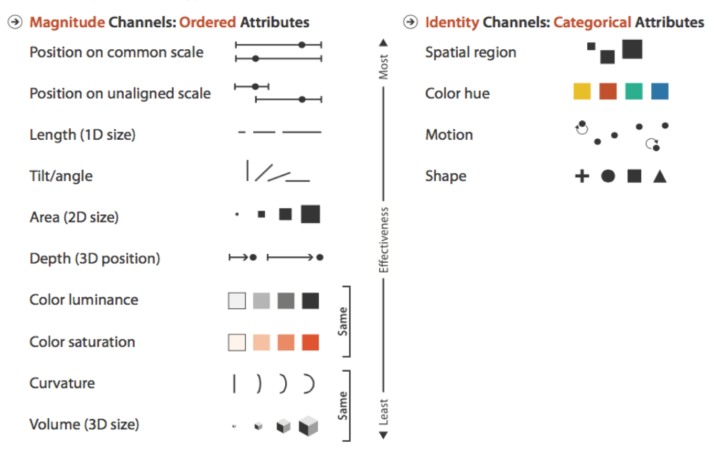
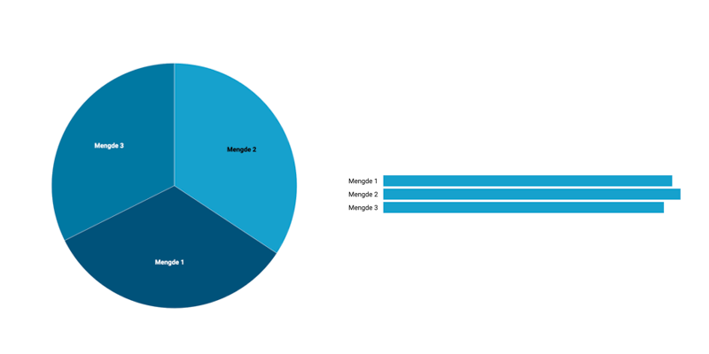

# Hva inngår i en lettlest datavisualisering?

Datavisualiseringer kan være en god og effektiv måte å  presentere data på, og er ofte mye lettere å tyde for et menneske enn rene tall. Likevel er det veldig mange som bruker datavisualiseringer som pynt, og ikke tar seg tid til å lage en datavisualisering som faktisk er lesbar og gir informasjon. Det finnes heldigvis noen enkle tommelfingerregler man kan følge som sørger for at visualiseringen din blir lesbar!

## Merker og kanaler

I faglitteratur om datavisualisering omtaler man gjerne de visuelle elementene som viser datapunkter for "merker" (marks). Hvert merke har én eller flere tilhørende "kanaler" (channels) som visuelt knytter market til datapunktet. Klassiske eksempler på et merke er en søyle i et søylediagram, og kanalen til dette merket er høyden på søylen. 

Hvilke kanaler man velger for å vise et merke i en datavisualisering avgjør i stor grad hvor presist man leser visualiseringen, og det har blitt gjort diverse forskning på hvilke kanaler som er mest effektive å bruke for nominal data hvor rekkefølgen har betydning (f.eks. klesstørrelser, geografiske koordinater, antall), og ordinal data hvor rekkefølgen ikke har noe å si (bilmerker, brukernavn, osv.).

Her er en oversikt over forskjellige kanaler, og hvor effektive de er:

## I praksis

Hvilke av mengdene er størst? Kakediagram og søylediagrammet under viser samme data (tre forskjellige mendger), men bruker forskjellige kanaler for å presentere dataene.

Som nevnt er merket som brukes i et søylediagram et areal i form av et avlangt rektangel. I kakediagram er merket et areal som ser ut som et kakestykke.

Grunnen til at det er så mye lettere å skille mellom søylene i søylediagrammet er fordi kanalen som viser mengde er "position on a common scale", mens det i kakediagrammet er "tilt/angle", som er en klart mindre effektiv måte å vise mengder på. Videre kan vi se at kanalen som brukes for å skille mellom de forskjellige typene mengde er lik for begge ("spatial region"), men at kakediagrammet på grunn av at kakestykkene er helt inntil hverandre må spe på med "color hue" for å kunne skille de forskjellige kategoriene fra hverandre. I søylediagrammet har vi derimot ikke brukt farge som kanal, og kan derfor spare bruken av dette til å vise noe tydeligere.

Neste gang noen kommer og ber deg lage et kakediagram, har du nå faglig argumentasjon for hvorfor det er en dårlig idé, og kan veilede vedkommende i en riktigere og mer effektiv retning.

## Videre lesning og inspirasjon

 * [Data types, Graphical Marks, and Visual Encoding Channels](https://observablehq.com/@uwdata/data-types-graphical-marks-and-visual-encoding-channels): En del av University of Washington sitt innføringsfag i datavisualisering.
 * Figuren over effektivitet til forskjellige kanaler kommer fra boken *Visualization Analysis & Design* av Tamara Munzner. Dette er en god fagbok som går mye mer i dybden rundt effektiv bruk av merker og kanaler for å lage gode visualiseringer.
 * Her er porteføljene til [Nadieh Bremer](https://www.visualcinnamon.com/portfolio/) og [Moritz Stefaner](https://truth-and-beauty.net/projects). Begge bruker prinsippene presenterte luken for å lage kreative, iøyenfallende og lesbare datavisualiseringer.
